# 🚚 Smart Navigation & Logistics Management System

<p align="center">

### A Data Structure Based Logistics Management System Using C

</p>

<p align="center">


</p>

---

## 📌 Project Overview

**Smart Navigation & Logistics Management System (SNLMS)** is a desktop-based logistics management application developed in the **C programming language** as a Data Structures capstone project.

The project demonstrates how different Data Structures and Algorithms can be applied to solve practical logistics problems such as warehouse management, package processing, product searching, route optimization, emergency package handling, and logistics analytics.

Instead of using a single data structure for the entire system, SNLMS maps different logistics operations to appropriate data structures.

The application provides a graphical interface using **Raylib** and integrates the underlying data structures with an interactive desktop user interface.

---

# 🎯 Objectives

The major objectives of the project are:

- To implement a practical application using the C programming language.
- To demonstrate the real-world application of Data Structures.
- To manage warehouse information efficiently.
- To process packages using queue-based operations.
- To provide efficient warehouse indexing.
- To implement fast product and warehouse searching.
- To represent logistics routes using graphs.
- To perform route optimization using graph algorithms.
- To support priority-based package processing.
- To provide logistics analytics.
- To generate reports from system data.
- To integrate Data Structures with a graphical user interface.
- To demonstrate algorithmic complexity and efficient data management.

---

# ❗ Problem Statement

Logistics systems need to manage large amounts of information involving warehouses, packages, products, destinations, routes, and operational statistics.

A poorly structured system can create problems such as:

- Difficult warehouse record management
- Inefficient package processing
- Slow searching
- Difficult resource indexing
- Inefficient route selection
- Lack of priority handling for urgent packages
- Difficulty analyzing logistics information

The Smart Navigation & Logistics Management System addresses these requirements by mapping each problem to an appropriate Data Structure or Algorithm.

---

# 💡 Proposed Solution

The proposed system combines multiple Data Structures and Algorithms into one logistics management application.

The major mapping is:

| Logistics Requirement | Data Structure / Algorithm |
|---|---|
| Warehouse Management | Linked List |
| Package Processing | Queue |
| Warehouse Indexing | AVL Tree |
| Product Searching | Hash Table |
| Warehouse Searching | Linear / Binary Search |
| Logistics Network | Graph |
| Network Traversal | BFS / DFS |
| Shortest Route | Dijkstra's Algorithm |
| All-Pairs Route Analysis | Floyd-Warshall |
| Priority Package Processing | Priority Queue / Heap |
| Data Sorting | Quick Sort / Merge Sort / Heap Sort |
| Persistent Data | File Handling |
| System Visualization | Raylib GUI |
| Reporting | Analytics / PDF Reporting |

This allows each operation to use a data structure suitable for its requirements.

---

# 🏗️ System Architecture

The application follows a modular architecture.

```text
                    ┌─────────────────────────┐
                    │       Raylib GUI        │
                    │ Dashboard / Modules     │
                    └────────────┬────────────┘
                                 │
                                 ▼
                    ┌─────────────────────────┐
                    │   Application Modules   │
                    └────────────┬────────────┘
                                 │
             ┌───────────────────┼───────────────────┐
             │                   │                   │
             ▼                   ▼                   ▼
      ┌─────────────┐     ┌─────────────┐     ┌─────────────┐
      │  Warehouse  │     │  Packages   │     │   Routes    │
      │   Module    │     │   Module    │     │   Module    │
      └──────┬──────┘     └──────┬──────┘     └──────┬──────┘
             │                   │                   │
             ▼                   ▼                   ▼
       Linked List             Queue              Graph
             │                   │              /   │   \
             ▼                   ▼             BFS DFS Dijkstra
         AVL Tree          Priority Queue          │
             │                   │             Floyd-Warshall
             ▼                   ▼
        Hash Table             Heap
             │
             ▼
       Search / Indexing
````

---

# 🧩 Main Project Modules

The project is organized into two major academic modules.

---

## 👨‍💻 Module 1 — Warehouse & Package Management

### Developed by: Deepak R

Module 1 focuses on the management and organization of warehouse and package information.

Major responsibilities include:

* Warehouse Management
* Warehouse CRUD operations
* Warehouse searching
* Package registration
* Package queue
* Package enqueue
* Package dequeue
* Package queue head/peek
* AVL-based indexing
* Hash-based searching
* File handling
* Data structure integration

### Data Structures

* Arrays
* Singly Linked List
* Queue
* AVL Tree
* Hash Table

### Algorithms

* Linear Search
* Binary Search
* Tree Traversals

---

# 🏢 Warehouse Management

Warehouse records are maintained using a dynamically managed **Linked List**.

Each warehouse can contain information such as:

* Warehouse ID
* Warehouse Name
* Location / City
* Capacity
* Current Stock
* Manager information

A linked-list representation allows warehouse records to be dynamically added and removed.

Example:

```text
HEAD
 │
 ▼
┌──────────────┐
│ WH-001       │
│ Warehouse A  │
└──────┬───────┘
       │
       ▼
┌──────────────┐
│ WH-002       │
│ Warehouse B  │
└──────┬───────┘
       │
       ▼
┌──────────────┐
│ WH-003       │
│ Warehouse C  │
└──────┬───────┘
       │
       ▼
      NULL
```

### Warehouse Operations

The application provides interfaces for:

* Adding a warehouse
* Updating a warehouse
* Searching a warehouse
* Viewing warehouse records
* Maintaining warehouse information

---

# 📦 Package Management

Packages are managed using a **Queue-based processing system**.

The basic queue follows:

```text
FIFO
First In → First Out
```

Example:

```text
FRONT
  │
  ▼
┌─────┐ → ┌─────┐ → ┌─────┐ → ┌─────┐
│ P001│   │ P002│   │ P003│   │ P004│
└─────┘   └─────┘   └─────┘   └─────┘
                                      ▲
                                     REAR
```

### Package Operations

The application supports:

* Enqueue Package
* View Package Queue
* View Queue Head
* Dequeue Package
* Package Registry

Package records can contain information such as:

* Package ID
* Sender
* Receiver
* Destination
* Weight
* Status
* Priority

---

# 🚨 Priority Queue

The project also implements priority-based package processing.

Priority levels are handled as:

```text
Priority 0 → Highest
Priority 1 → Medium
Priority 2 → Lowest
```

Packages with higher priority are processed before lower-priority packages.

For equal priorities, FIFO ordering is preserved.

### Complexity

| Operation | Complexity |
| --------- | ---------: |
| Enqueue   |       O(n) |
| Peek      |       O(1) |
| Dequeue   |       O(1) |
| Size      |       O(1) |
| Is Empty  |       O(1) |

The priority queue implementation also handles:

* Invalid priorities
* Empty queues
* NULL queues
* Invalid package records

---

# 🌳 AVL Tree — Warehouse Indexing

The project uses an **AVL Tree** for balanced warehouse indexing.

An AVL Tree is a self-balancing Binary Search Tree.

The tree maintains balance after insertion and deletion using rotations.

Example:

```text
             WH-020
            /      \
        WH-010     WH-030
        /   \      /   \
    WH-005 WH-015 WH-025 WH-040
```

### AVL Operations

* Insert
* Search
* Delete
* Traversal
* Balance maintenance

### Complexity

| Operation | Complexity |
| --------- | ---------: |
| Search    |   O(log n) |
| Insert    |   O(log n) |
| Delete    |   O(log n) |
| Traversal |       O(n) |

---

# 🔎 Product Search Using Hashing

The system uses hashing for efficient product/resource searching.

A product identifier such as an SKU can be converted into a hash index.

```text
Product ID
    │
    ▼
Hash Function
    │
    ▼
Hash Index
    │
    ▼
Product Record
```

Example:

```text
SKU-1042 → Warehouse Bin 12
SKU-2087 → Warehouse Bin 04
```

Hash-based lookup provides an average-case search complexity of:

```text
O(1)
```

depending on the hash function and collision-handling strategy.

---

# 🔍 Searching

The project demonstrates different searching techniques.

## Linear Search

Linear Search checks records sequentially.

```text
O(n)
```

It can be used when data is unsorted.

---

## Binary Search

Binary Search repeatedly divides sorted data into two sections.

```text
O(log n)
```

Binary Search requires sorted data.

---

## Hash-Based Search

Hashing provides average constant-time lookup.

```text
O(1) average
```

---

# 🗺️ Module 2 — Route Optimization & Analytics

### Developed by: R Tamilarasan

Module 2 focuses on logistics route planning, emergency package processing, and analytics.

Major responsibilities include:

* Logistics network representation
* Route optimization
* Graph processing
* Emergency delivery
* Priority queue
* Route analysis
* BFS
* DFS
* Dijkstra
* Floyd-Warshall
* Sorting
* Analytics
* Reporting

---

# 🌐 Logistics Network Graph

The logistics network is represented using a **Graph**.

In the graph:

* Vertices represent logistics hubs/cities.
* Edges represent connections between locations.
* Edge weights represent distance or route cost.

Example:

```text
             B
            / \
           /   \
          A-----C
           \     \
            \     \
             D-----E
```

The graph provides the foundation for route optimization.

---

# 🔵 Breadth-First Search — BFS

BFS explores a graph level by level.

BFS can be used for:

* Network traversal
* Connectivity checking
* Reachability analysis

Complexity:

```text
O(V + E)
```

where:

* V = number of vertices
* E = number of edges

---

# 🔴 Depth-First Search — DFS

DFS explores a graph deeply before backtracking.

It can be used for:

* Network exploration
* Connectivity analysis
* Graph traversal

Complexity:

```text
O(V + E)
```

---

# 📍 Dijkstra's Algorithm

Dijkstra's Algorithm is used to determine shortest paths from a source node in a weighted graph with non-negative edge weights.

Example:

```text
Source: Warehouse A
Destination: Warehouse H

Shortest Path:

A → C → E → H
```

The algorithm maintains the current shortest known distance to each vertex and repeatedly processes the closest unvisited vertex.

This provides a basis for route optimization within the logistics network.

---

# 🌐 Floyd-Warshall Algorithm

Floyd-Warshall calculates shortest paths between all pairs of vertices.

For a network containing several logistics hubs, it can determine shortest routes between every pair of nodes.

Standard complexity:

```text
O(V³)
```

This makes it useful for complete network analysis.

---

# 🚨 Emergency Delivery

Emergency delivery uses priority-based processing.

Example:

```text
Priority 0
    ↓
Emergency / Critical

Priority 1
    ↓
Express

Priority 2
    ↓
Normal
```

A Priority Queue / Heap allows higher-priority deliveries to be processed before lower-priority deliveries.

---

# 📊 Analytics

The Analytics module provides an overview of logistics operations.

The system can present information related to:

* Warehouse count
* Warehouse capacity
* Current stock
* Warehouse utilization
* Package queue
* Package weight
* Route hubs
* Route connections
* Route/network information

The analytics interface provides a centralized view of system information.

---

# 📄 PDF Reporting

The system includes PDF/report generation functionality.

Reports can be used to present system information such as:

* Warehouse statistics
* Package statistics
* Route information
* Analytics information

This provides a printable representation of the application's operational data.

---

# 🖥️ Graphical User Interface

The application uses **Raylib** for the desktop graphical interface.

The major pages include:

```text
Dashboard
Warehouse
Packages
Routes
Analytics
Settings
```

The interface also includes:

* Sidebar navigation
* Dashboard cards
* Tables
* Buttons
* Search interfaces
* Package queue controls
* Route controls
* Analytics visualization
* System settings
* Splash screen
* PDF/report functionality

---

# 📸 Application Screenshots

All application screenshots are stored inside:

```text
screenshots/
```

---

## Splash Screen

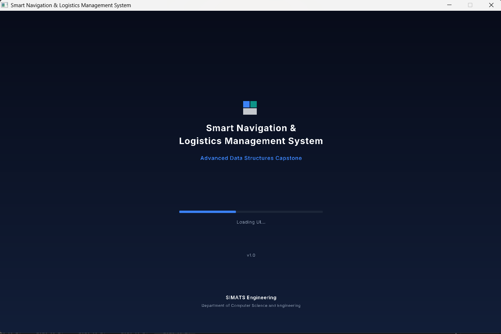

The splash screen provides the initial application loading interface.

---

## Dashboard

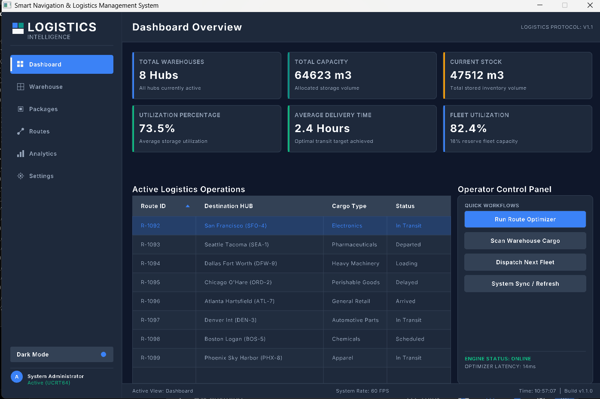

The dashboard provides an overview of the logistics system and provides navigation to the major modules.

---

## Warehouse Catalog

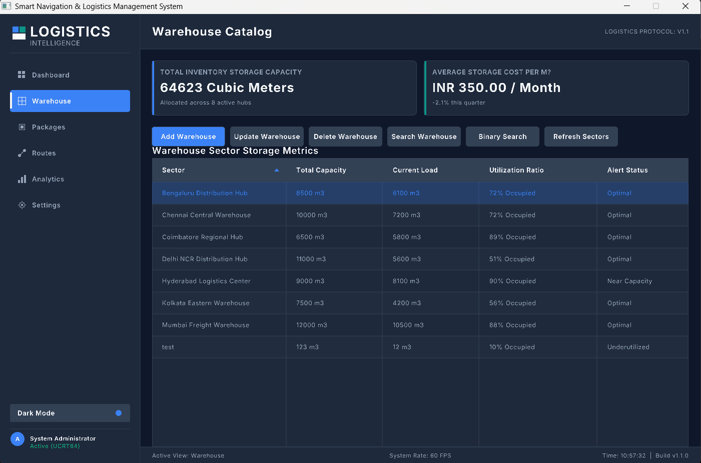

The warehouse catalog displays the currently available warehouse records.

---

## Add Warehouse

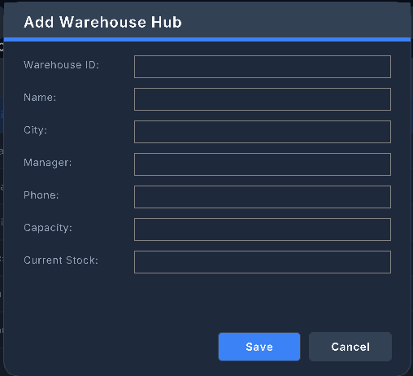

The Add Warehouse interface allows new warehouse information to be entered into the system.

---

## Update Warehouse

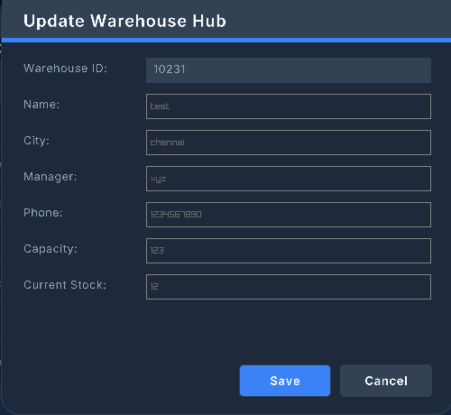

The Update Warehouse interface allows an existing warehouse record to be modified.

---

## Search Warehouse

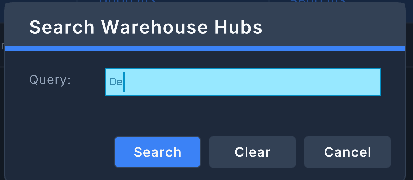

The warehouse search interface provides a way to locate a specific warehouse record.

---

## Package Registry

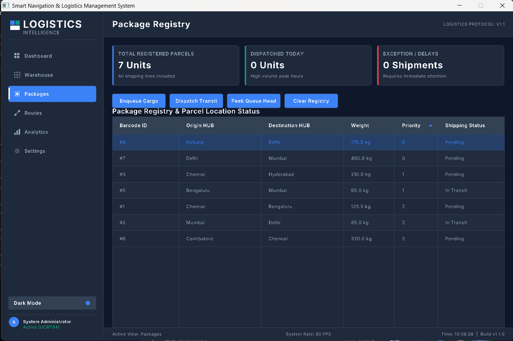

The package registry displays package information maintained by the system.

---

## Enqueue Package

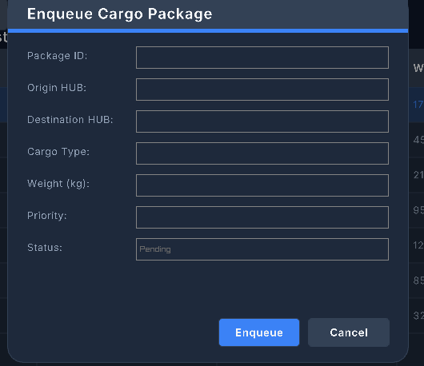

The Enqueue Package interface adds a package to the processing queue.

---

## Package Queue Head

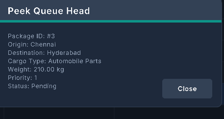

The queue-head operation displays the package currently at the front of the queue without removing it.

---

## Dequeue Package

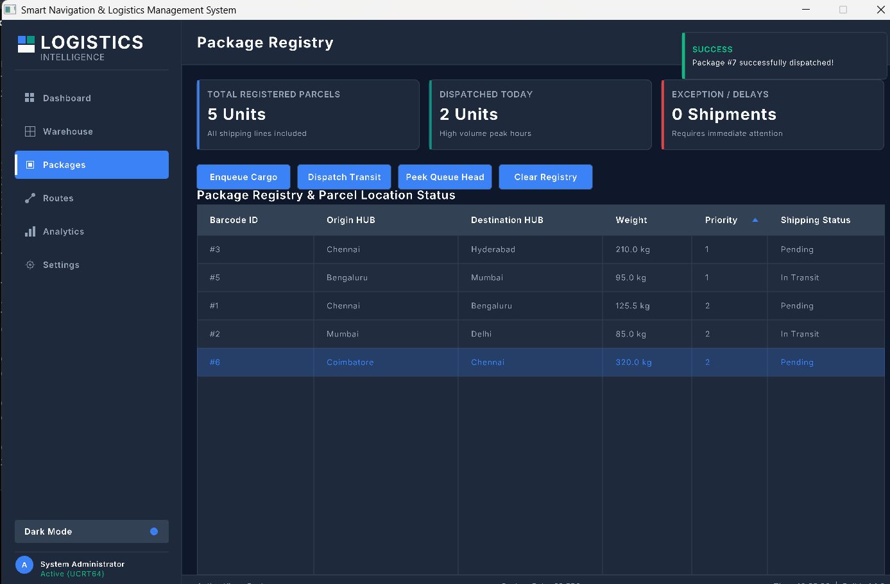

The Dequeue Package operation removes the package from the front of the queue for processing.

---

## Route Dashboard

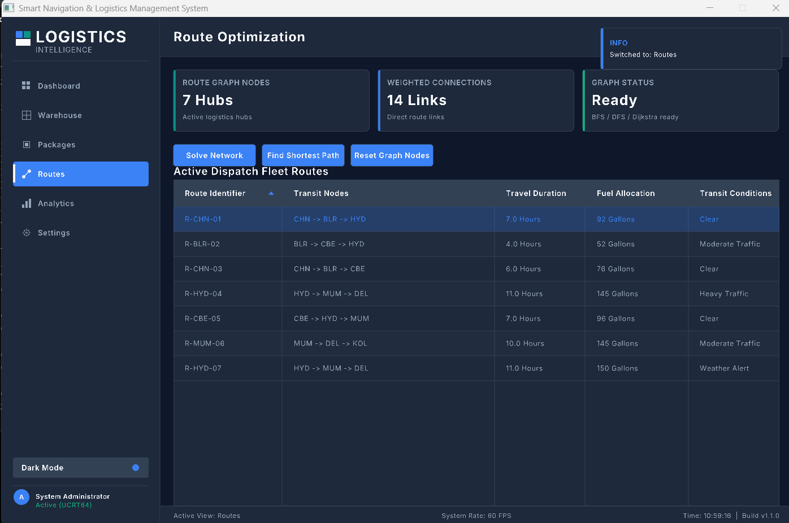

The Route Dashboard provides access to route optimization and logistics network operations.

---

## Route Optimizer

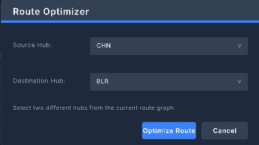

The Route Optimizer interface allows route-related inputs to be selected and processed.

---

## Route Optimizer Output

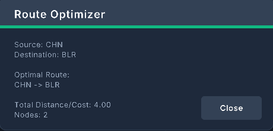

The Route Optimizer Output displays the result generated by the route optimization process.

---

## Route Network Analysis

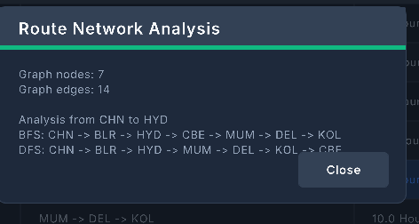

The Route Network Analysis interface provides information about the logistics network and graph-based operations.

---

## Performance Analytics

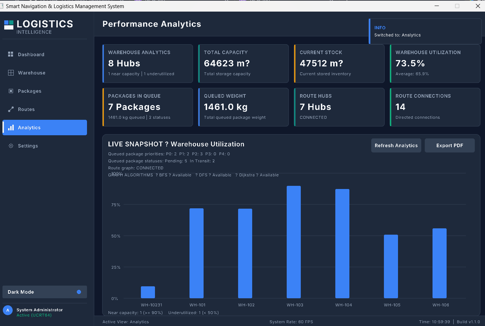

The Performance Analytics page provides a visual overview of warehouse, package and route statistics.

---

## Search Result

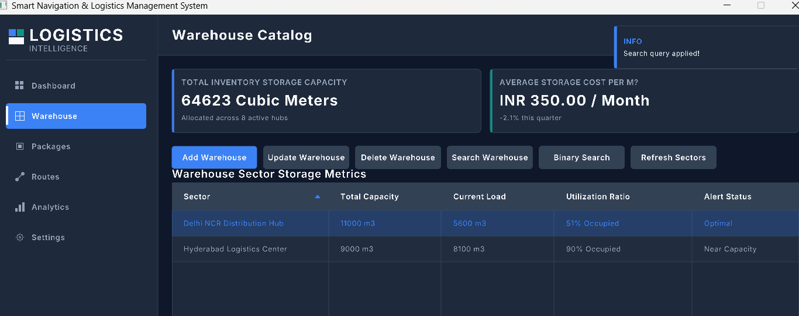

The search result interface displays the result of a system search operation.

---

## System Settings

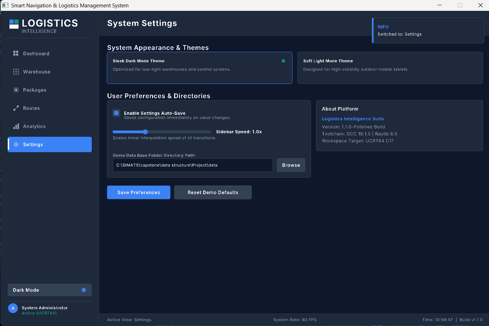

The Settings page provides configuration and system information.

---

# 🛠️ Technology Stack

| Technology   | Purpose                         |
| ------------ | ------------------------------- |
| C            | Core programming language       |
| Raylib 6.0   | Graphical User Interface        |
| raygui       | GUI controls                    |
| CMake        | Build system                    |
| Ninja        | Build backend                   |
| GCC          | C compiler                      |
| MSYS2 UCRT64 | Windows development environment |
| Git          | Version control                 |
| GitHub       | Source code hosting             |

---

# 💻 System Requirements

## Operating System

Windows 10 / Windows 11

## Required Software

The following tools are required:

* MSYS2
* UCRT64 GCC toolchain
* CMake
* Ninja
* Git
* Raylib 6.0

---

# 📦 Development Environment Setup

## 1. Install MSYS2

Download and install MSYS2 from:

[https://www.msys2.org/](https://www.msys2.org/)

Install it in the default location:

```text
C:\msys64
```

---

# 2. Open UCRT64 Terminal

From the Windows Start Menu, open:

```text
MSYS2 UCRT64
```

The terminal should display:

```text
UCRT64
```

in the prompt.

---

# 3. Update MSYS2

Run:

```bash
pacman -Syu
```

If MSYS2 asks you to close and reopen the terminal, do so.

Then run:

```bash
pacman -Su
```

---

# 4. Install Development Tools

Install the UCRT64 toolchain:

```bash
pacman -S --needed mingw-w64-ucrt-x86_64-toolchain
```

Install CMake:

```bash
pacman -S --needed mingw-w64-ucrt-x86_64-cmake
```

Install Ninja:

```bash
pacman -S --needed mingw-w64-ucrt-x86_64-ninja
```

Install Raylib:

```bash
pacman -S --needed mingw-w64-ucrt-x86_64-raylib
```

Git can be installed with:

```bash
pacman -S --needed git
```

---

# 🔍 Verify Installation

Check GCC:

```bash
gcc --version
```

Check CMake:

```bash
cmake --version
```

Check Ninja:

```bash
ninja --version
```

Check Raylib:

```bash
pacman -Qs raylib
```

---

# 📥 Clone the Repository

Clone the project using:

```bash
git clone https://github.com/Deepak-3357/Smart-Navigation-Logistics-Management-System.git
```

Enter the project:

```bash
cd Smart-Navigation-Logistics-Management-System
```

---

# 🏗️ Build the Project

Create a build directory:

```bash
mkdir build
```

Enter the build directory:

```bash
cd build
```

Configure the project:

```bash
cmake -G Ninja ..
```

Build the application:

```bash
cmake --build .
```

If the build is successful, the executable will be generated in the build directory.

---

# ▶️ Run the Application

From the project root:

```bash
./build/smart_logistics.exe
```

Or from inside the build directory:

```bash
./smart_logistics.exe
```

---

# 🪟 Windows DLL Runtime

The application uses the Raylib shared library.

The build configuration copies the required Raylib runtime libraries beside the executable.

The required runtime files include:

```text
libraylib.dll
glfw3.dll
```

Therefore, the build directory should contain:

```text
build/
├── smart_logistics.exe
├── libraylib.dll
└── glfw3.dll
```

This allows the application to run from normal Windows environments without requiring the user to manually copy the Raylib DLLs.

---

# 📁 Project Structure

```text
Smart-Navigation-Logistics-Management-System/
│
├── assets/
│   └── fonts/
│       ├── Inter-Regular.ttf
│       ├── Inter-SemiBold.ttf
│       └── Inter-Bold.ttf
│
├── data/
│   └── warehouse.dat
│
├── include/
│   ├── common.h
│   ├── components.h
│   ├── font_manager.h
│   ├── layout.h
│   ├── package.h
│   ├── raygui.h
│   ├── route.h
│   ├── screen_manager.h
│   ├── screens.h
│   ├── theme_manager.h
│   ├── ui_manager.h
│   ├── warehouse.h
│   └── window_manager.h
│
├── src/
│   ├── components.c
│   ├── font_manager.c
│   ├── main.c
│   ├── package.c
│   ├── route.c
│   ├── screen_manager.c
│   ├── theme_manager.c
│   ├── ui_manager.c
│   ├── warehouse.c
│   ├── window_manager.c
│   │
│   └── screens/
│       ├── analytics.c
│       ├── dashboard.c
│       ├── packages.c
│       ├── routes.c
│       ├── settings.c
│       └── warehouse.c
│
├── screenshots/
│   ├── 01-splash-screen.png
│   ├── 02-dashboard.png
│   ├── 03-warehouse-catalog.png
│   ├── 04-add-warehouse.png
│   ├── 05-update-warehouse.png
│   ├── 06-search-warehouse.png
│   ├── 07-package-registry.png
│   ├── 08-enqueue-package.png
│   ├── 09-head-of-package-queue.png
│   ├── 10-dequeue-package.png
│   ├── 11-route-dashboard.png
│   ├── 12-route-optimizer.png
│   ├── 13-route-optimizer-output.png
│   ├── 14-route-network-analysis.png
│   ├── 15-performance-analytics.png
│   ├── 16-search-result.png
│   └── 17-system-settings.png
│
├── CMakeLists.txt
├── .gitignore
└── README.md
```

---

# 🔄 Application Workflow

The overall system workflow is:

```text
                 START
                   │
                   ▼
             Splash Screen
                   │
                   ▼
               Dashboard
                   │
       ┌───────────┼────────────┐
       │           │            │
       ▼           ▼            ▼
   Warehouse    Packages      Routes
       │           │            │
       ▼           ▼            ▼
 Linked List     Queue        Graph
       │           │            │
       ▼           ▼            ▼
 AVL Index    Priority Queue  Dijkstra
       │           │            │
       └───────────┼────────────┘
                   │
                   ▼
              Analytics
                   │
                   ▼
               Reporting
                   │
                   ▼
                  END
```

---

# ⏱️ Complexity Analysis

| Data Structure / Algorithm | Operation               |                Complexity |
| -------------------------- | ----------------------- | ------------------------: |
| Array                      | Access                  |                      O(1) |
| Linked List                | Head Insertion          |                      O(1) |
| Linked List                | Search                  |                      O(n) |
| Linked List                | Traversal               |                      O(n) |
| Queue                      | Enqueue                 |                      O(1) |
| Queue                      | Dequeue                 |                      O(1) |
| Queue                      | Peek                    |                      O(1) |
| AVL Tree                   | Search                  |                  O(log n) |
| AVL Tree                   | Insert                  |                  O(log n) |
| AVL Tree                   | Delete                  |                  O(log n) |
| Hash Table                 | Average Search          |                      O(1) |
| Linear Search              | Search                  |                      O(n) |
| Binary Search              | Search                  |                  O(log n) |
| BFS                        | Traversal               |                  O(V + E) |
| DFS                        | Traversal               |                  O(V + E) |
| Dijkstra                   | Shortest Path           | Depends on implementation |
| Floyd-Warshall             | All-Pairs Shortest Path |                     O(V³) |
| Heap                       | Insert                  |                  O(log n) |
| Heap                       | Extract                 |                  O(log n) |
| Quick Sort                 | Average                 |                O(n log n) |
| Merge Sort                 | Worst                   |                O(n log n) |
| Heap Sort                  | Worst                   |                O(n log n) |

---

# 🔬 Data Structure to Real-World Problem Mapping

```text
Warehouse Management
        │
        ▼
   Linked List
        │
        ▼
Dynamic Warehouse Records


Package Processing
        │
        ▼
      Queue
        │
        ▼
FIFO Package Processing


Warehouse Indexing
        │
        ▼
     AVL Tree
        │
        ▼
Balanced Searching


Product Searching
        │
        ▼
    Hash Table
        │
        ▼
Fast Lookup


Route Network
        │
        ▼
      Graph
        │
        ├── BFS
        ├── DFS
        ├── Dijkstra
        └── Floyd-Warshall


Emergency Delivery
        │
        ▼
 Priority Queue / Heap
        │
        ▼
Priority-Based Processing
```

---

# 🧪 Testing

The application was tested for:

* Project compilation
* Application launch
* GUI navigation
* Warehouse operations
* Package enqueue
* Package queue viewing
* Package dequeue
* Warehouse searching
* Route interface
* Analytics interface
* PDF/report functionality
* Window behavior
* Mouse interaction
* Minimize and restore behavior
* Runtime Raylib DLL availability

The project was built successfully using the **MSYS2 UCRT64 environment** and CMake/Ninja.

---

# 🛡️ Error Handling

The application includes handling for invalid or unsafe operations such as:

* NULL data structures
* Empty queues
* Invalid package data
* Invalid priority values
* Invalid search operations
* Missing records
* File access failures
* Invalid input values

The priority queue specifically validates priority values and handles empty/NULL conditions safely.

---

# 💾 Data Persistence

The project maintains application data using file handling.

Example:

```text
data/
└── warehouse.dat
```

Data persistence allows application information to be stored beyond a single execution session.

---

# 🎨 User Interface

The GUI uses a dark-themed logistics dashboard design.

The application includes:

* Dark mode
* Inter font family
* Sidebar navigation
* Dashboard cards
* Tables
* Search interfaces
* Modal/input interfaces
* Route visualization
* Analytics panels
* Settings page
* Splash screen
* Status information

The GUI is implemented using Raylib with raygui-based controls.

---

# 🔮 Future Scope

The project can be extended with:

* Real-time GPS tracking
* Live traffic information
* IoT warehouse sensors
* Barcode and QR-code scanning
* Cloud database integration
* Mobile application support
* AI-based demand forecasting
* AI-assisted route prediction
* Real-time vehicle monitoring
* Multi-warehouse synchronization
* Advanced inventory prediction
* Real-time logistics alerts

---

# 🎓 Learning Outcomes

This project demonstrates practical knowledge of:

* C programming
* Structures and pointers
* Dynamic memory allocation
* Linked Lists
* Queues
* Priority Queues
* AVL Trees
* Hash Tables
* Graphs
* BFS
* DFS
* Dijkstra's Algorithm
* Floyd-Warshall Algorithm
* Searching
* Sorting
* File Handling
* GUI programming
* Modular software design
* CMake build systems
* Algorithm complexity analysis

---

# 👥 Team

## Deepak R

### Module 1

**Warehouse & Package Management**

Responsibilities:

* Warehouse Management
* Warehouse Linked List
* Package Queue
* Priority Queue implementation
* AVL Warehouse Indexing
* Hash-based Searching
* Searching Operations
* File Handling
* GUI integration for Module 1

---

## R Tamilarasan

### Module 2

**Route Optimization & Analytics**

Responsibilities:

* Logistics Graph
* BFS
* DFS
* Dijkstra
* Floyd-Warshall
* Route Optimization
* Emergency Delivery
* Priority-based processing
* Sorting
* Analytics
* Reporting

---

# 🏫 Academic Information

**Project:** Smart Navigation & Logistics Management System

**Course:** Data Structures

**Course Code:** CSA0302

**Department:** Computer Science and Engineering

**Institution:** Saveetha School of Engineering

**University:** Saveetha Institute of Medical and Technical Sciences (SIMATS)

---

# 📚 Project Significance

SNLMS demonstrates how theoretical Data Structures concepts can be converted into a practical software system.

The project does not use Data Structures only as isolated academic implementations. Instead, each structure is connected to a realistic logistics operation.

For example:

```text
Warehouse → Linked List

Package Processing → Queue

Warehouse Index → AVL Tree

Product Search → Hash Table

Routes → Graph

Shortest Route → Dijkstra

Emergency Package → Priority Queue

Analytics → Searching + Sorting
```

This relationship between the problem and the selected Data Structure is one of the central objectives of the project.

---

# 🏁 Conclusion

The **Smart Navigation & Logistics Management System** is a practical Data Structures capstone project developed using C.

The system integrates multiple Data Structures and Algorithms into a unified logistics application.

Warehouse information is dynamically managed using Linked Lists, packages are processed through Queues, warehouse records can be indexed using AVL Trees, and fast resource searching is supported through Hash Tables.

The route module represents logistics connections as graphs and provides graph traversal and shortest-path algorithms for route analysis. Priority-based package processing is handled using a Priority Queue / Heap.

The Raylib-based graphical interface brings these concepts together into an interactive desktop application containing Warehouse, Packages, Routes, Analytics and Settings modules.

Overall, the project demonstrates the practical relationship between **Data Structures, Algorithms, software design, GUI development and real-world logistics management**.

---

# ⭐ Project Highlights

```text
✓ C-based logistics application
✓ Raylib graphical interface
✓ Warehouse management
✓ Package queue management
✓ Priority package processing
✓ AVL warehouse indexing
✓ Hash-based searching
✓ Graph-based route management
✓ BFS and DFS
✓ Dijkstra shortest path
✓ Floyd-Warshall analysis
✓ Analytics dashboard
✓ PDF/report generation
✓ File-based data persistence
✓ Modular C architecture
✓ CMake build system
```

---

# 🙏 Acknowledgement

This project was developed as part of the academic Data Structures coursework at:

**Saveetha School of Engineering
Saveetha Institute of Medical and Technical Sciences**

The project demonstrates the practical implementation of Data Structures and Algorithms through a logistics management use case.

---

## 📌 Repository

GitHub Repository:

[https://github.com/Deepak-3357/Smart-Navigation-Logistics-Management-System](https://github.com/Deepak-3357/Smart-Navigation-Logistics-Management-System)

---

## ⭐ Thank You

**Smart Navigation & Logistics Management System**

**Data Structures Capstone Project**

**Deepak R | R Tamilarasan**

**Saveetha School of Engineering**

````

### One thing I want you to do before pushing

Your screenshot folder should look like:

```text
Smart-Navigation-Logistics-Management-System/
│
├── assets/
├── data/
├── include/
├── src/
├── screenshots/       ← ADD THIS
│   ├── 01-splash-screen.png
│   ├── 02-dashboard.png
│   ├── 03-warehouse-catalog.png
│   ├── 04-add-warehouse.png
│   ├── 05-update-warehouse.png
│   ├── 06-search-warehouse.png
│   ├── 07-package-registry.png
│   ├── 08-enqueue-package.png
│   ├── 09-head-of-package-queue.png
│   ├── 10-dequeue-package.png
│   ├── 11-route-dashboard.png
│   ├── 12-route-optimizer.png
│   ├── 13-route-optimizer-output.png
│   ├── 14-route-network-analysis.png
│   ├── 15-performance-analytics.png
│   ├── 16-search-result.png
│   └── 17-system-settings.png
│
├── CMakeLists.txt
├── .gitignore
└── README.md
````

**Do not upload `build/`, `.vs/`, temporary `.txt` error/build logs, `.o` files, or the generated `.exe` to GitHub.** Your `.gitignore` should handle most of that.

Also, I intentionally **did not put Driver History anywhere** in this README because you established that it isn't implemented. That will keep your GitHub documentation consistent with what you can actually demonstrate during the viva.
